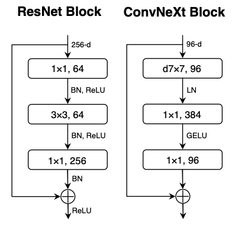
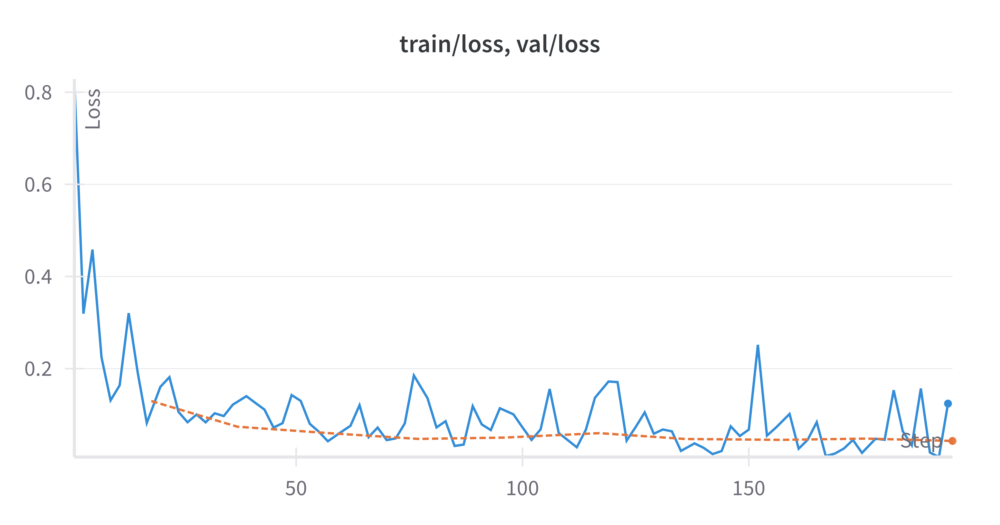
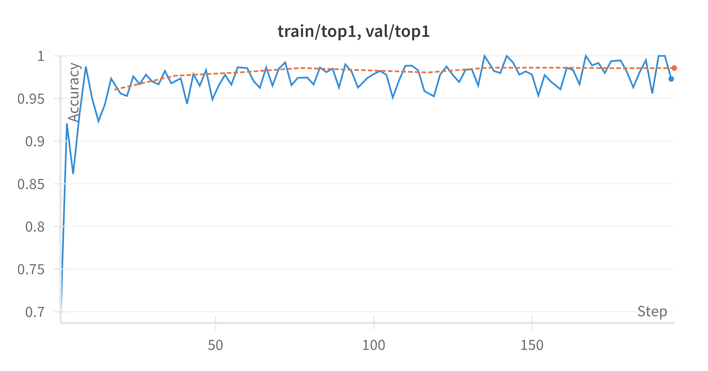
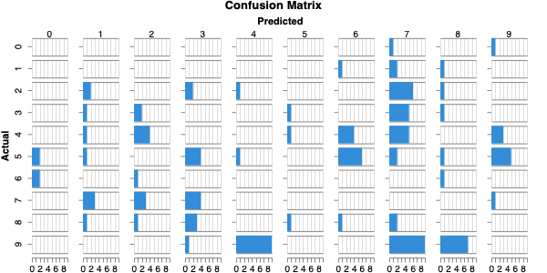

## Overview

DigitNet is a custom MNIST classifier designed using a ConvNeXt-inspired architecture. This post outlines the steps I took, the design decisions made, and the results achieved.

## Introduction

### What is the MNIST Dataset?

The MNIST dataset is a benchmark dataset in computer vision. It consists of 70,000 grayscale images of handwritten digits (0-9), split into 60,000 training images and 10,000 test images. Each image is 28x28 pixels and labeled with the corresponding digit.

### How Does Computer Vision Work?

Computer vision tasks involve teaching computers to interpret and analyze visual information. For digit classification, the goal is to develop a model that can accurately map pixel data to the correct digit. Modern architectures like ConvNeXt, ResNet and others play an important role in extracting meaningful features from raw image data.

## Related Work

### ResNet

ResNet introduced the concept of residual learning, enabling very deep networks by addressing vanishing gradient issues. This architecture's simplicity and effectiveness have made it a staple for various vision tasks.

### ConvNeXt v2

ConvNeXt is a modern reinterpretation of convolutional neural networks (CNNs), designed to bridge the gap between CNNs and transformer architectures. Its design emphasizes simplicity, modularity, and scalability, making it an excellent fit for tasks like MNIST classification or even more complex problems.

## Implementation

### Data Transformations

To prepare the MNIST dataset for training, I applied several preprocessing steps:

- **Normalization**: Scaling pixel values to the [0, 1] range for better convergence.
- **Augmentation**: Techniques like random rotation, shifting, and zooming were used to increase dataset variability and prevent overfitting.
  - This allows us to have "more" training samples, in theory, increasing the generalization of our model.

### Model Implementation

DigitNet adopts a ConvNeXt-inspired architecture. Key features include:

- **Depthwise Convolutions**: Lightweight operations that reduce computational overhead.
- **Layer Normalization**: Ensures stable training and improves generalization.
- **Residual Blocks**: Simplifies learning deeper feature representations.

The final layer maps the extracted features to 10 output logits, one for each digit class.

### Training Implementation

The model was trained using the following configuration:

- **Loss Function**: Cross-entropy loss, suitable for multiclass classification.
- **Optimizer**: AdamW optimizer with a learning rate scheduler for adaptive training.
- **Epochs**: 10 epochs with early stopping to avoid overfitting.
- **Hardware**: Trained on a Apple M3 GPU for efficient computation.

## Results

### Training Curves

The model demonstrated rapid convergence with minimal overfitting, as shown below:

### Confusion Matrix

The confusion matrix highlights the model's strong performance across all digit classes, with minimal misclassifications. While the performance of this model is very strong, it still mixes up numbers with similar shapes, such as 7s and 9s.

